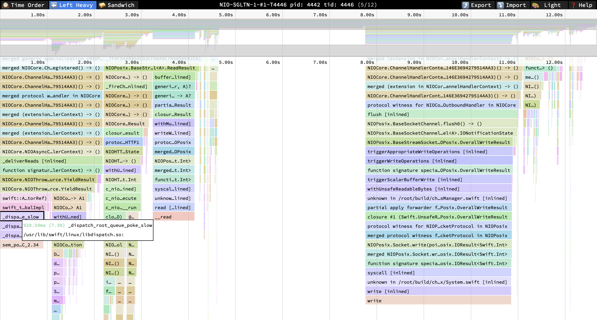

# Swift Profile Recorder, an in-process sampling profiler

Want to profile your software in restricted Kubernetes or Docker containers or other environments where you don't have `CAP_SYS_PTRACE`? Look no further.

## What is this?

This is a sampling profiler (like `sample` on macOS) with the special twist that it runs _inside_ the process that gets sampled. This means that it doesn't need `CAP_SYS_PTRACE` or any other privileges to work.

You can pull it in as a fully self-contained Swift Package Manager dependency and then use it in your app.

Swift Profile Recorder is an on- and off-CPU profiler, which means that it records waiting threads (e.g., sleeps, locks, blocking system calls) as well as running (i.e., computing) threads.

### Supported OSes

At the moment, it only supports Linux and macOS.
It could also support other operating systems, but that's not implemented at this point in time.

## How can I use it?

### Via Swift Profile Recorder Server

The easiest way to use Swift Profile Recorder in your application is to run the Swift Profile Recorder Server.
This allows you to retrieve symbolicated samples with a single `curl` (or any other HTTP client) command.

#### Using the Sampling Server

##### One-off setup to get your application ready for sampling

- Add a `swift-profile-recorder` dependency: `.package(url: "https://github.com/apple/swift-profile-recorder.git", .upToNextMinor(from: "0.3.0"))`
- Make your main `executableTarget` depend on `ProfileRecorderServer`: `.product(name: "ProfileRecorderServer", package: "swift-profile-recorder"),`
- Add the following few lines at the very beginning of your main function (`static func main()` or `func run()`):

```swift
import ProfileRecorderServer

[...]

@main
struct YourApp {
   func run() async throws {
       // Run `ProfileRecorderServer` in the background if enabled via environment variable. Ignore failures.
       // It will be automatically cancelled if this function returns.
       //
       // Example:
       //   PROFILE_RECORDER_SERVER_URL_PATTERN='unix:///tmp/my-app-samples-{PID}.sock' ./my-app
       async let _ = ProfileRecorderServer(configuration: .parseFromEnvironment()).runIgnoringFailures(logger: logger)

       [... your regular main function ...]
    }
}
```

##### Using the profiling server

Once you added the profile recorder server to your app, you can enable it using an environment variable (assuming you passed `configuration: .parseFromEnvironment()`):

```bash
# Request the profile recording server to listen on a UNIX Domain Socket at path `/tmp/my-app-samples-{PID}.sock`.
# `{PID}` will automatically be replaced with your process's process ID.
PROFILE_RECORDER_SERVER_URL_PATTERN=unix:///tmp/my-app-samples-{PID}.sock .build/release/MyApp
```

After that, you're ready to request samples:

```bash
curl --unix-socket /tmp/my-app-samples-62012.sock -sd '{"numberOfSamples":10,"timeInterval":"100 ms"}' http://localhost/sample | swift demangle --compact > /tmp/samples.perf
```

Now, a file called `/tmp/samples.perf` should have been created. This file is in the standard Linux perf format.

#### Visualisation

Whilst `.perf` files are plain text files, they are most easily digested in a visual form such as FlameGraphs.

Below, some compatible visualisation tools:

- [Speedscope](https://speedscope.app) ([speedscope.app](https://speedscope.app)), simply drag a `.perf` file (such as `/tmp/samples.perf` in the example above) onto the Speedscope website.
- [Firefox Profiler](https://profiler.firefox.com) ([profiler.firefox.com](https://profiler.firefox.com)), simply drag a `.perf` file (such as `/tmp/samples.perf` in the example above) onto the Firefox Profiler website.
- The original [FlameGraph](https://github.com/brendangregg/Flamegraph) tooling. Try for example `./stackcollapse-perf.pl < /tmp/samples.perf | swift demangle --compact | ./flamegraph.pl > /tmp/samples.svg && open -a Safari /tmp/samples.svg`.

## Compatibility

### Formats

- The Linux perf script format (`.perf`, like what `perf record && perf script` would emit)
- The `pprof` format (`.pprof`, like what Golang's pprof emits)
- The "collapsed" format (like what FlameGraph's `stackcollapse*` scripts emit)

### Profile recording server URL endpoints

- pprof's [`/debug/pprof/profile` endpoint](https://pkg.go.dev/net/http/pprof)
- Swift Profile Recorder's own `/sample` endpoint

## Example profiles

- Hummingbird's [hello example](https://github.com/hummingbird-project/hummingbird-examples/tree/main/hello) load-tested by `wrk -T50s -c 20000 -t 200  http://127.0.0.1:8080` running on macOS

  - Applied [a small diff](#swipr-diff-hummingbird-hello) to enable Swift Profile Recorder in Humminbird's hello example
  - Server started with just one SwiftNIO thread for a cleaner profile: `NIO_SINGLETON_BLOCKING_POOL_THREAD_COUNT=1 NIO_SINGLETON_GROUP_LOOP_COUNT=1 PROFILE_RECORDER_SERVER_URL_PATTERN=unix:///tmp/swipr-{PID}.sock .build/release/App`
  = Samples received using `curl -sd '{"numberOfSamples":1000,"timeInterval":"10ms"}' --unix-socket /tmp/swipr-SERVER_PID.sock http://unix | swift demangle --compact > /tmp/samples.perf`
  - View [profile in Firefox Profiler](https://share.firefox.dev/4pJf8Sl)
  - Screenshot of speedscope.app:
    
- Hummingbird's [hello example](https://github.com/hummingbird-project/hummingbird-examples/tree/main/hello) load-tested by `wrk -T50s -c 20000 -t 200  http://127.0.0.1:8080` running on Linux (Ubuntu 20.04, Swift 6.2, unprivileged container)
  - Applied [a small diff](#swipr-diff-hummingbird-hello) to enable Swift Profile Recorder in Humminbird's hello example
  - Server started with just one SwiftNIO thread for a cleaner profile: `NIO_SINGLETON_BLOCKING_POOL_THREAD_COUNT=1 NIO_SINGLETON_GROUP_LOOP_COUNT=1 PROFILE_RECORDER_SERVER_URL_PATTERN=unix:///tmp/swipr-{PID}.sock .build/release/App`
  = Samples received using `curl -sd '{"numberOfSamples":1000,"timeInterval":"10ms"}' --unix-socket /tmp/swipr-SERVER_PID.sock http://unix | swift demangle --compact > /tmp/samples.perf`
  - View [profile in Firefox Profiler](https://share.firefox.dev/42JY1Ge)
  - Screenshot of speedscope.app:
    

### Example diffs

#### Add Swift Profile Recorder to hummingbird-examples/hello
<div id="swipr-diff-hummingbird-hello"></div>


<details>
<summary>Expand here to see `git diff -U1` onto [commit `97a09f0664679f017616a82894848b267c5e7068`](https://github.com/hummingbird-project/hummingbird-examples/commit/97a09f0664679f017616a82894848b267c5e7068)</summary>

```diff
diff --git a/hello/Package.swift b/hello/Package.swift
index ae0b6d2..33b24ed 100644
--- a/hello/Package.swift
+++ b/hello/Package.swift
@@ -11,2 +11,3 @@ let package = Package(
         .package(url: "https://github.com/apple/swift-argument-parser.git", from: "1.4.0"),
+        .package(url: "git@github.com:apple/swift-profile-recorder.git", branch: "main"),
     ],
@@ -18,2 +19,3 @@ let package = Package(
                 .product(name: "Hummingbird", package: "hummingbird"),
+                .product(name: "ProfileRecorderServer", package: "swift-profile-recorder"),
             ],
diff --git a/hello/Sources/App/app.swift b/hello/Sources/App/app.swift
index 13131d9..95b114a 100644
--- a/hello/Sources/App/app.swift
+++ b/hello/Sources/App/app.swift
@@ -1,2 +1,3 @@
 import ArgumentParser
+import ProfileRecorderServer

@@ -17,2 +18,5 @@ struct HummingbirdArguments: AsyncParsableCommand {
         )
+        async let _ = ProfileRecorderServer(configuration: .parseFromEnvironment()).runIgnoringFailures(
+            logger: app.logger
+        )
         try await app.runService()
diff --git a/proxy-server/Package.swift b/proxy-server/Package.swift
index f4cf65d..a75eee8 100644
--- a/proxy-server/Package.swift
+++ b/proxy-server/Package.swift
@@ -13,2 +13,3 @@ let package = Package(
         .package(url: "https://github.com/swift-server/async-http-client.git", from: "1.6.0"),
+        .package(url: "git@github.com:apple/swift-profile-recorder.git", branch: "main"),
     ],
@@ -22,2 +23,3 @@ let package = Package(
                 .product(name: "NIOExtras", package: "swift-nio-extras"),
+                .product(name: "ProfileRecorderServer", package: "swift-profile-recorder"),
             ],
diff --git a/proxy-server/Sources/App/app.swift b/proxy-server/Sources/App/app.swift
index af7fcc0..b491db1 100644
--- a/proxy-server/Sources/App/app.swift
+++ b/proxy-server/Sources/App/app.swift
@@ -2,2 +2,3 @@ import ArgumentParser
 import Hummingbird
+import ProfileRecorderServer

@@ -19,2 +20,5 @@ struct HummingbirdArguments: AsyncParsableCommand, AppArguments {
         let app = buildApplication(self)
+        async let _ = ProfileRecorderServer(configuration: .parseFromEnvironment()).runIgnoringFailures(
+            logger: app.logger
+        )
         try await app.runService()
```

</summary>
